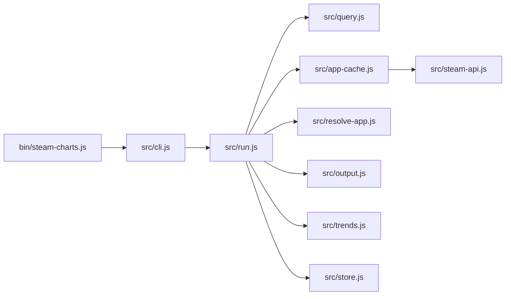

# steam-charts-cli

`steam-charts` is a zero-dependency Node.js CLI for Steam player and store metrics.

It supports:

- current concurrent players from the official Steam Web API
- monthly observed player history from Steam Charts
- daily forecast output derived from observed history
- terminal trend charts
- SteamDB-style store snapshot metrics
- all-time highest and lowest observed average and peak values

## Installation

### Requirements

- Node.js `20+`

### Install dependencies

```bash
npm install
```

### Run locally

```bash
node bin/steam-charts.js --help
```

### Link the CLI

```bash
npm link
steam-charts --help
```

## Setup

Text-name lookups require a Steam Web API key because the CLI resolves names against the official Steam app list before it fetches metrics.

Supported key sources, in precedence order:

1. `--api-key <key>`
2. `STEAM_API_KEY` in your shell
3. `STEAM_API_KEY` in a local `.env`

Recommended local setup:

```bash
cp .env.example .env
```

Then set:

```bash
STEAM_API_KEY=your-steam-web-api-key
```

Numeric app-id queries work without an API key.

## Quick Start

Fetch current concurrent players as CSV:

```bash
steam-charts 730
```

Fetch current concurrent players as JSON:

```bash
steam-charts 730 --format json
```

Resolve by exact game name:

```bash
steam-charts "Counter-Strike 2"
```

Search the app catalog:

```bash
steam-charts "counter" --search
```

Fetch observed history plus forecast:

```bash
steam-charts history 730 --months 12 --forecast-days 30
```

Render a terminal trend chart:

```bash
steam-charts chart "Counter-Strike 2" --months 6 --forecast-days 14
```

Fetch a store snapshot:

```bash
steam-charts store 730
steam-charts store 730 --format json
```

Show all-time extrema:

```bash
steam-charts highest 730
steam-charts lowest "Counter-Strike 2" --format json
```

Write output to a file:

```bash
steam-charts history 730 --output ./history.json
steam-charts store 730 --format json --output ./store.json
```

## Command Reference

### Root lookup

```bash
steam-charts <query> [--format csv|json] [--output <path>]
```

- `query` can be a numeric app id or an exact game name
- default output is one CSV row with header
- source is always `steam-web-api`

Default CSV columns:

```text
appid,name,current_players,queried_at,source
```

### Search

```bash
steam-charts <query> --search [--refresh-app-list]
```

- searches the cached official Steam app list
- requires `STEAM_API_KEY` or `--api-key`
- prints tab-separated `appid` and `name` lines

### History

```bash
steam-charts history <query> [--months <n>] [--forecast-days <n>] [--output <path>]
```

- output is JSON only
- default `--months` is `12`
- default `--forecast-days` is `30`
- observed points include:
  - `label`
  - `average_players`
  - `peak_players`
  - `average_change`
  - `average_change_pct`
  - `peak_change`
  - `peak_change_pct`
  - `estimated: false`
- forecast points include:
  - `date`
  - `average_players`
  - `peak_players`
  - `estimated: true`

The gain fields are numeric deltas and numeric percent values against the immediately previous observed month in the returned history window. The first returned observed point uses `null` gain fields.

### Chart

```bash
steam-charts chart <query> [--months <n>] [--forecast-days <n>]
```

- terminal-only output
- renders stacked sections for:
  - average players
  - peak players
- uses solid bars for observed points and shaded bars for forecast points

### Store

```bash
steam-charts store <query> [--format text|json] [--output <path>]
```

Default fields:

- `daily_active_users_rank`
- `top_sellers_rank`
- `wishlist_activity_rank`
- `followers`
- `reviews`
- `captured_at`
- `source`

### Highest / Lowest

```bash
steam-charts highest <query> [--format text|json] [--output <path>]
steam-charts lowest <query> [--format text|json] [--output <path>]
```

Both commands operate over the full observed Steam Charts monthly history for the app and return:

- `average: { value, label }`
- `peak: { value, label }`

## Data Sources

The CLI intentionally mixes official and third-party sources depending on what Steam exposes.

| Feature | Source | Notes |
| --- | --- | --- |
| Current concurrent players | Steam Web API | Official |
| App list / name resolution | Steam Web API | Official |
| Observed monthly history | Steam Charts | Third-party scrape |
| Forecast | Local Holt linear smoothing | Generated locally |
| Store snapshot metrics | SteamDB-style page | Third-party scrape |

As of March 7, 2026, Steam does not expose an official retroactive daily player-history API or an official API for the store snapshot metrics shown in this CLI. That makes `history`, `chart`, `store`, `highest`, and `lowest` inherently more brittle than the root current-player lookup.

In live use, SteamDB may also return Cloudflare challenge responses such as `403 Forbidden` to non-browser clients, and Steam Charts can intermittently return edge errors such as `520` or `522`. The CLI surfaces those upstream failures clearly, but it cannot guarantee that the scraped commands will work from every environment at every moment.

## Cache And Resolution Behavior

The app list cache lives at:

```text
~/.steam-charts/app-list.json
```

Behavior:

- cache TTL is 24 hours
- `--refresh-app-list` forces a refresh before name resolution
- stale cache is reused if refresh fails and a cache already exists
- unresolved exact-name lookups fail with candidate suggestions instead of fuzzy auto-selection

## Architecture



### Module overview

- `bin/steam-charts.js`
  - process entrypoint
  - help/version handling
  - top-level exit code and error output

- `src/cli.js`
  - argv parsing
  - command detection
  - command-scoped validation for `--format`, `--months`, `--forecast-days`, and `--output`

- `src/run.js`
  - top-level command dispatcher
  - shared app resolution flow
  - output routing to stdout or files

- `src/query.js`
  - classifies a query as numeric app id or text name

- `src/app-cache.js`
  - manages the local Steam app-list cache
  - handles TTL and stale-cache fallback

- `src/steam-api.js`
  - official Steam Web API client
  - current-player request
  - paginated app-list request

- `src/resolve-app.js`
  - exact-name matching
  - search ranking
  - candidate suggestions when name resolution is ambiguous or missing

- `src/output.js`
  - CSV / JSON serialization for root current-player lookups

- `src/trends.js`
  - Steam Charts page fetch
  - monthly history parsing
  - gain calculations
  - Holt linear smoothing forecast generation
  - terminal chart rendering
  - highest / lowest extrema extraction

- `src/store.js`
  - SteamDB-style store page fetch
  - store metrics parsing
  - terminal text formatting for snapshot output

## Development

Run the test suite:

```bash
npm test
```

Run the syntax check:

```bash
npm run lint
```

Optional coverage run:

```bash
node --test --experimental-test-coverage
```

## Support

If you enjoy this project, buy me some tokens: [buymeacoffee.com/amircs](https://buymeacoffee.com/amircs)
