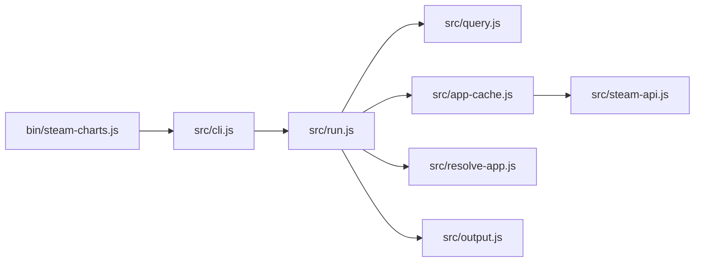

# steam-charts-cli

`steam-charts` is a zero-dependency Node.js CLI for looking up Steam apps and exporting current player data as CSV or JSON.

It is built around one main flow:

- resolve a Steam app by app id or exact name
- fetch the current player count from Steam
- emit one machine-readable record to stdout or a file

It also includes a search mode for finding app ids before you fetch player counts.

## What The CLI Does

- Fetch current player counts by Steam app id
- Fetch current player counts by exact game name
- Search the Steam app catalog by keyword
- Output CSV by default
- Output JSON when needed
- Cache the Steam app list locally for faster repeated lookups
- Read `STEAM_API_KEY` from `--api-key`, the environment, or a local `.env`

## Installation

### Requirements

- Node.js `20+`

### Local install

```bash
npm install
```

### Use the local entrypoint directly

```bash
node bin/steam-charts.js --help
```

### Link it as a local command

```bash
npm link
steam-charts --help
```

## Setup

Name-based lookups and catalog search require a Steam Web API key.

You can provide it in any of these ways, in this order:

1. `--api-key <key>`
2. `STEAM_API_KEY` in the shell environment
3. `STEAM_API_KEY` in a local `.env` file

### Recommended local setup

```bash
cp .env.example .env
```

Then edit `.env`:

```bash
STEAM_API_KEY=your-steam-web-api-key
```

## Main CLI Commands

There are no subcommands. The CLI is one main command with a few modes.

### 1. Fetch by app id

```bash
steam-charts 730
```

Default output:

```csv
appid,name,current_players,queried_at,source
730,Counter-Strike 2,1234567,2026-03-07T12:00:00.000Z,steam-web-api
```

Notes:

- This does not require an API key for the player-count request itself.
- The `name` column is filled from cached app metadata when available.

### 2. Fetch by exact game name

```bash
steam-charts "Counter-Strike 2"
```

Notes:

- This requires `STEAM_API_KEY` or `--api-key`.
- Exact matching is intentional. If there is no unique exact match, the CLI prints candidate apps instead of guessing.

### 3. Search for app ids

```bash
steam-charts "counter" --search
```

Example output:

```text
730	Counter-Strike 2
10	Counter-Strike
```

Notes:

- Search requires `STEAM_API_KEY` or `--api-key`.
- This is the easiest way to discover the app id you want before running the main fetch flow.

### 4. Write output to a file

```bash
steam-charts 730 --output ./players.csv
steam-charts 730 --format json --output ./players.json
```

### 5. Force a fresh app-list refresh

```bash
steam-charts "Counter-Strike 2" --refresh-app-list
```

Use this when:

- the local app cache is stale
- a game was recently added or renamed
- you want to avoid relying on cached results

### 6. Help and version

```bash
steam-charts --help
steam-charts --version
```

## Options

- `--search`: search the Steam app catalog instead of fetching current player counts
- `--output <path>`: write the result to a file instead of stdout
- `--api-key <key>`: override the Steam API key for a single command
- `--refresh-app-list`: force an app-list refresh before lookup
- `--format <csv|json>`: output format, default `csv`
- `-h`, `--help`: print usage
- `-v`, `--version`: print version

## Output Formats

### CSV

Default format. One header row plus one data row.

Header:

```csv
appid,name,current_players,queried_at,source
```

### JSON

```bash
steam-charts 730 --format json
```

Example:

```json
{
  "appid": 730,
  "name": "Counter-Strike 2",
  "current_players": 1234567,
  "queried_at": "2026-03-07T12:00:00.000Z",
  "source": "steam-web-api"
}
```

## Cache Behavior

The Steam app list is cached at:

```text
~/.steam-charts/app-list.json
```

Behavior:

- cache TTL is 24 hours
- warm cache skips a catalog refresh
- `--refresh-app-list` forces a refresh
- if refresh fails and a stale cache exists, the CLI falls back to the stale cache and prints a warning to `stderr`

## Architecture

The codebase is intentionally small and split by responsibility.



### Module overview

- `bin/steam-charts.js`
  Handles process startup, help/version dispatch, and top-level error handling.

- `src/cli.js`
  Parses flags and turns raw argv into a normalized options object.

- `src/run.js`
  Main orchestration layer. It chooses between search mode and fetch mode, resolves the app, fetches player counts, and writes output.

- `src/query.js`
  Distinguishes numeric app-id queries from text-name queries.

- `src/app-cache.js`
  Reads, writes, refreshes, and validates the cached Steam app list.

- `src/steam-api.js`
  Encapsulates the Steam HTTP requests for current players and the paginated app list.

- `src/resolve-app.js`
  Resolves an exact app name and ranks partial matches for search and error suggestions.

- `src/output.js`
  Serializes results into CSV or JSON.

## Development

### Run tests

```bash
npm test
```

### Syntax check

```bash
npm run lint
```

### Test coverage

```bash
node --test --experimental-test-coverage
```
